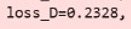
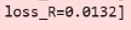
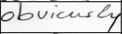
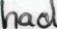
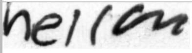
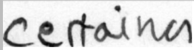
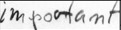

# Text-To-Handwriting
**TABLE OF CONTENTS**

- [AIM](#_m5mn95kqhvcd)
- [INTRODUCTION](#_ofpada4cw899)
- [DESCRIPTION](#_efc86x3i1gsl)
- [TECH STACK](#_1pwpnsf666ud)
- [MODELS AND LOSSES](#_pf665k3parjs)
- [REQUIREMENTS](#_fsqi3rn9841f)
- [ACKNOWLEDGEMENTS AND RESOURCES](#_byi7k7pzo743)

**TEXT TO HANDWRITING**

## **AIM-**

To convert any typed text to real handwritten images without relying on fixed vocabulary by giving input of few style samples(around 15 images per writer) that is the model should capture global and local styles of the writer.

## **INTRODUCTION-**

Traditional handwriting synthesis models are often limited by large dataset requirements or a dependency on a fixed vocabulary, making them impractical for true personalization. We address this by utilizing a Conditional Generative Adversarial Network (CGAN) architecture. The CGAN is ideally suited for this task because it allows us to condition the output (the generated handwriting image) directly on two inputs: the textual content and the unique style vector learned from the writer.

## **DESCRIPTION-**

The described GAN-based Text-to-Handwriting project basically takes image of sample handwriting from writer and converts any typed text into handwritten images in specific writer's style . GAN combines two vectors (style + content) to output a realistic handwriting image. The core idea of a GAN is based on the "indirect" training through the discriminator, another neural network that can tell how "realistic" the input seems, which itself is also being updated dynamically.It is used with two key encoders:

- Content Encoder: Ensures the typed text is correctly reflected in the output.
- Style Encoder: Learns writer-specific characteristics from provided word images.
- The generator, built from residual blocks and upsampling layers, uses AdaIN (adaptive instance normalization) to adapt its output to reflect the extracted style while faithfully visualizing the text content. To convert text to handwriting ,we use a special generator called cGAN. The generator then generates synthetic or fake data which looks exactly like real one.
- Three auxiliary networks-(1) a discriminator that judges realism, (2) a writer classifier that verifies author style, and (3) a text recognizer (often a CNN + RNN attention-based decoder)-evaluate the generator's output from different angles: appearance, style fidelity, and textual correctness.
[alt text](images/architecture.jpg)

Architecture of proposed handwriting generation model

## **TECH STACK-**

- [**Python**](https://www.python.org/)
- [**Numpy**](https://numpy.org/)
- [**Pytorch**](https://pytorch.org/)
- [**Pandas**](https://pandas.pydata.org/)
- [**Torchvision**](https://docs.pytorch.org/vision/)
- [**tqdm**](https://github.com/tqdm/tqdm)

## **MODELS AND LOSSES-**

**Dataset -** iam_handwriting_word_database (115K files)

<https://www.kaggle.com/datasets/nibinv23/iam-handwriting-word-database>

**Losses-**

- **Style Loss-**

**[alt text](images/style_loss.jpg)**

- **Generator Loss-**

**[alt text](images/gen_loss.jpg)**

- **Discriminator Loss-**

****

- **Recognizer Loss-**

****

- **Output example-**












## **REQUIREMENTS-**

- Install [Python 3.1](https://www.python.org/download/releases/3.1/).
- Install [Pip](https://pypi.org/project/pip/) and verify its installation using the following terminal command:

```
pip --version
```

- Run the following command to install all the dependencies

```
pip install pandas torch torchvision tqdm Pillow
```

- Clone the repository
```
git clone "https://github.com/Vanshika9S/Text-To-Handwriting.git"
```

- Run the model(.ipynb) on Kaggle or Jupiter Notebooks

## **ACKNOWLEDGEMENTS AND RESOURCES-**

- Course on [Deep Learning Specialization](https://www.coursera.org/specializations/deep-learning) by [DeepLearning.AI](http://deeplearning.ai)
- [Kaggle Datasets](https://www.kaggle.com/datasets)
- [GANwriting: Content-Conditioned Generation of Styled Handwritten Word Images](https://arxiv.org/abs/2003.02567)